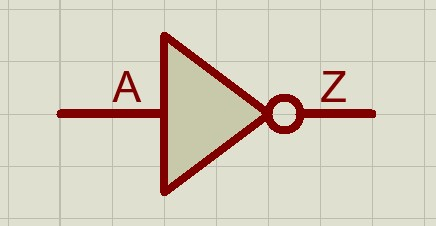
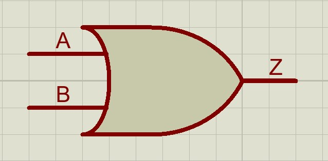
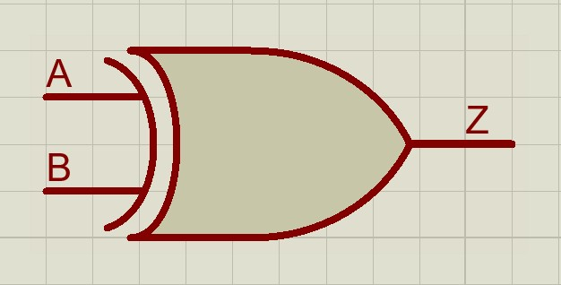
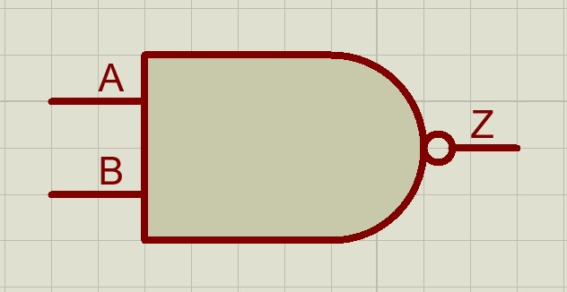

# Laborator LD - Circuite combinationale in Verilog

## Porti logice elementare

### Poarta NOT(NU)
- iesirea sa este inversul intrarii, adica este falsa daca intrarea este adevarata si adevarata daca este falsa
- simbol:
 
  
- tabel de adevar 
  | A | Z |
  | - | - |  
  | 0 | 1 |
  | 1 | 0 |
- ecuatie:
  
  $Z = A' = \bar{A}$

### Poarta AND(SI)
- iesirea sa este adevarata doar daca ambele intrari sunt adevarate
- altfel spus, iesirea sa este falsa daca oricare dintre intrari este falsa
- simbol:

  
- tabel de adevar:
  | A | B | Z |
  | - | - | - |
  | 0 | 0 | 0 |
  | 0 | 1 | 0 |
  | 1 | 0 | 0 |
  | 1 | 1 | 1 |

- ecuatie:
  
  $Z = A \cdot B$

### Poarta OR(SAU)
- iesirea sa este adevarata daca oricare dintre intrari este adevarata
- iesirea sa este falsa doar daca ambele intrari sunt false
- simbol:

  
- tabel de adevar:
  | A | B | Z |
  | - | - | - |
  | 0 | 0 | 0 |
  | 0 | 1 | 1 |
  | 1 | 0 | 1 |
  | 1 | 1 | 1 |

- ecuatie:
  
  $Z = A + B$

### Poarta XOR(SAU Exclusiv)
- iesirea sa este adevarata daca cele 2 intrari au valori de adevar diferite
- altfel spus, este o poarta SAU care este falsa si in cazul in care cele 2 intrari sunt adevarate
- simbol:
  
  
- tabel de adevar:
  | A | B | Z |
  | - | - | - |
  | 0 | 0 | 0 |
  | 0 | 1 | 1 |
  | 1 | 0 | 1 |
  | 1 | 1 | 0 |
- ecuatie:
  
  Z = A ^ B
- din tabelul de adevar se observa ca:
  
  $Z = AB'+A'B$

### Poarta NAND(SI-NU)
- se comporta ca o poarta SI a carei iesire este negata
- simbol:
  
- tabel de adevar:
  | A | B | Z |
  | - | - | - |
  | 0 | 0 | 1 |
  | 0 | 1 | 1 |
  | 1 | 0 | 1 |
  | 1 | 1 | 0 |
- ecuatie:
  
  $Z = \overline{AB}$

### Poarta NOR(SAU-NU)
- se comporta ca o poarta SAU a carei iesire este negata
- simbol:
  
- tabel de adevar:
  | A | B | Z |
  | - | - | - |
  | 0 | 0 | 1 |
  | 0 | 1 | 0 |
  | 1 | 0 | 0 |
  | 1 | 1 | 0 |
- ecuatie:
  
  $Z = \overline{A+B}$

## Module si instante in Verilog
- modulele in Verilog sunt bucati de cod ce pot fi utilizate in diverse parti ale programului
- seamana cu functiile din alte limbaje de programare
- sintaxa este urmatoarea:
  ```
  module module_name
    (input input1, input2,
    output output1, output2)

    // module code
  endmodule
    ```
- pentru a folosi un modul, acesta trebuie instantiat
  - atunci cand instantiem, ne aflam deja intr-un modul, pe care il numim modul parinte
  - pentru a instantia un modul trebuie sa:
    - alegem un nume pentru instanta
    - pentru fiecare semnal din modul, trebuie sa alegem un semnal din modulul parinte 
  - modulele se pot conecta intre ele prin semnale de tip `wire`
  - de exemplu, daca o iesire a unui modul este intrare a altuia, semnalul corespunzator trebuie sa fie de tip `wire`
  - un semnal de tip `wire` este ca un fir fizic, care nu poate sa memoreze o valoare, spre deosebire de un semnal de tip `reg` care memoreaza o valoare pana cand aceasta este modificata

## Sumator pe 1 bit
- circuit ce primeste 2 numere pe 1 bit, si un transport/carry initial, si le calculeaza suma si eventualul transport
- rezulta urmatorul tabel de adevar:
  | a | b | c_in | s | c_out |
  | - | - | - | - | - |
  | 0 | 0 | 0 | 0 | 0 |
  | 0 | 0 | 1 | 1 | 0 |
  | 0 | 1 | 0 | 1 | 0 |
  | 0 | 1 | 1 | 0 | 1 |
  | 1 | 0 | 0 | 1 | 0 |
  | 1 | 0 | 1 | 0 | 1 |
  | 1 | 1 | 0 | 0 | 1 |
  | 1 | 1 | 1 | 1 | 1 |
- din tabel obtinem urmatoarele ecuatii:
  - $s = a'b'c_{in} + a'bc_{in}' + ab'c_{in}' + abc_{in}$
    - $s = a'(b\verb|^|c_{in})+a(b\verb|^|c_{in})'$
    - $s = a\verb|^|b\verb|^|c_{in}$
  - $c_{out} = a'bc_{in}+ab'c_{in}+abc_{in}'+abc_{in}$
    - $c_{out} = c_{in}(a'b+ab')+ab(c_{in}'+c_{in})$
    - $c_{out} = c_{in}(a\verb|^|b)+ab$
  - din tabel se observa ca $c_{out}$ este adevarat oricand 2 dintre intrari sunt active, deci ecuatia acestuia se poate scrie si astfel:
    - $c_{out} = ab + ac_{in} + bc_{in}$
- schema:
  
- Descriere Verilog prin flux de date:
  - foloseste instructiunea `assign`
    - `assign #2 x = a + b`
    - actualizeaza valoarea lui `x` atunci cand se modifica orice semnal din partea dreapta, adica `a` sau `b`
    - actualizarea se intampla dupa un delay, in acest caz de `2` unitati de timp
    - delay-ul este necesar pentru ca pot exista glitch-uri, adica un semnal sa isi schimbe valoarea logica pentru un timp foarte scurt, fara ca aceasta schimbare sa fie dorita
    - daca delay-ul este mai mare decat "un timp foarte scurt", atunci modificarea eronata a semnalului nu se propaga la `x`
  - ```
    `timescale 1ns/1ps
    module full_adder_cell
      (input a, b, c_in,
      output s, c_out)

      assign #2 c_out = (a & b) | (a & c_in) | (b & c_in);
      assign #2 s = a^b^c_in;
    endmodule
    ```
  - modularea prin flux de date este potrivita in acest caz deoarece cunoastem ecuatiile logice pentru cele 2 iesiri ale circuitului